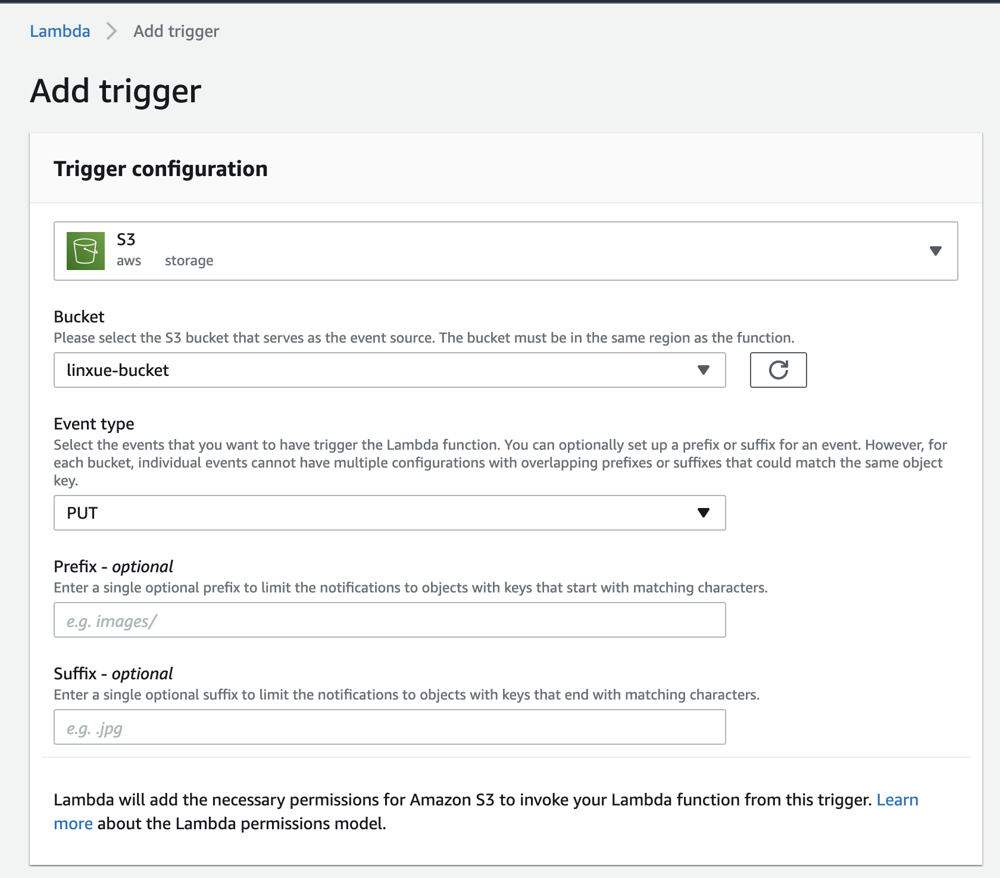

# aws-training-lambda

# Basic
#### 1. What is serverless?
传统上，我们已经构建并部署了 web 应用程序，对这些应用程序，我们可以对服务器发出的 HTTP 请求进行一定程度的控制。我们的应用程序运行在该服务器上，我们负责为其配置和管理资源。
无服务器计算（或简称 serverless），是一种执行模型，在该模型中，云服务商（AWS，Azure 或 Google Cloud）负责通过动态分配资源来执行一段代码，并且仅收取运行代码所使用资源的费用。该代码通常运行在无状态的容器中，能够被包括 HTTP 请求、数据库事件、队列服务、监控报警、文件上传、调度事件（cron 任务）等各种事件触发。被发送到云服务商执行的代码通常是以函数的形式，因此，无服务器计算有时是指 “函数即服务” 或者 FAAS。
#### 2. Create lambda function with AWS Web Console and test 

#### 3. Lambda function via aws cli with ZIP file and invoke Create lambda
- 给自己的Role加操作权限

- 打function.zip包

- 通过cli命令创建function

    `aws lambda create-function --function-name linxue-lambda-function-cli \
--zip-file fileb://function.zip --handler index.handler --runtime nodejs12.x \
--role arn:aws:iam::160071257600:role/service-role/linxue-lambda-function-role-64bgjenu`

#### 4. Create lambda by aws cloudformation

#### 5. Log lambda request event to cloudwatch

# Advanced
#### 1. Cloudwatch events trigger lambda regularly
通过在lambda函数添加tigger来触发Cloudwatch event，使用rate或cron表达式设置频率，如下图

#### 2. Copy file from a s3 bucket to another s3 bucket
- 创建两个bucket

- Add s3 tigger

#### 3. Trigger Cloudwatch alarm when Lambda failed.

